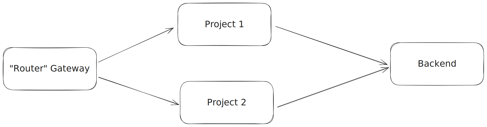

# A/B Test Gateways

This sample demonstrates how to send some amount of traffic to different Zuplo API Gateways and have the specific gateway be sticky for a particular user.

This type of A/B testing can be useful for rolling out a new version of your API Gateway or doing blue/green deployments.

> NOTE: In order to use this example, you must have Zuplo's KV storage enabled on your account. This is a paid feature available only to enterprise customers.

## How it Works

This example user three different Zuplo project. The first, called "router" is the API Gateway that decides where to route the request. The other two projects called "project 1" and "project 2" are the main API Gateways that contain all your routes. You can think of project 1 and 2 as different versions of the same gateway where one version is used to test new changes.



After a request is authenticated (in the case of the example using the "fake auth" policy), the user is randomly assigned to either the `test` or `control` group.

```ts
let val = rand < FLIGHT_PERCENT ? "test" : "control";
```

The result of the assignment is stored in Zuplo's distributed Key Value storage. This way, the result of the assignment can be used on later requests. This prevents the user from randomly moving between the different test groups.

```ts
await kv.put(key, val);
```

On subsequent requests, the assignment is pulled from Key Value storage.

```ts
let val = await kv.get(key);
```

Finally, a `context.custom` property is set, in this case `apiUrl` based on the user's assignment. That URL value can then be used in later policies and handlers to route requests to the correct backend.

## Calling the API

In order to call the API and see the A/B test in action, make a request and set the header `fake-user`. This fake authentication policy allows you to simulate the current user.

```sh
curl -i -H "fake-user: 123" https://ab-test-backend-main-e1f9895.zuplo.app/test
```
